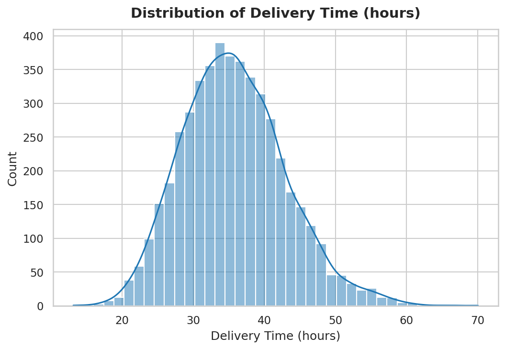
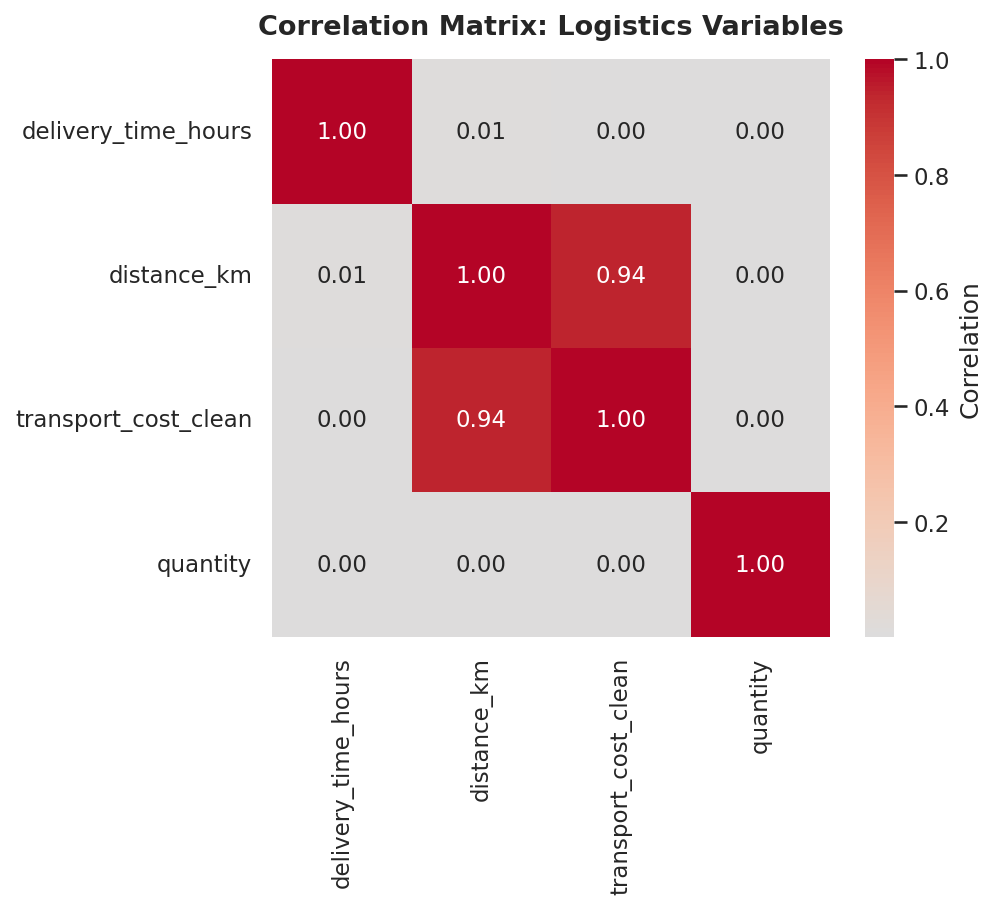
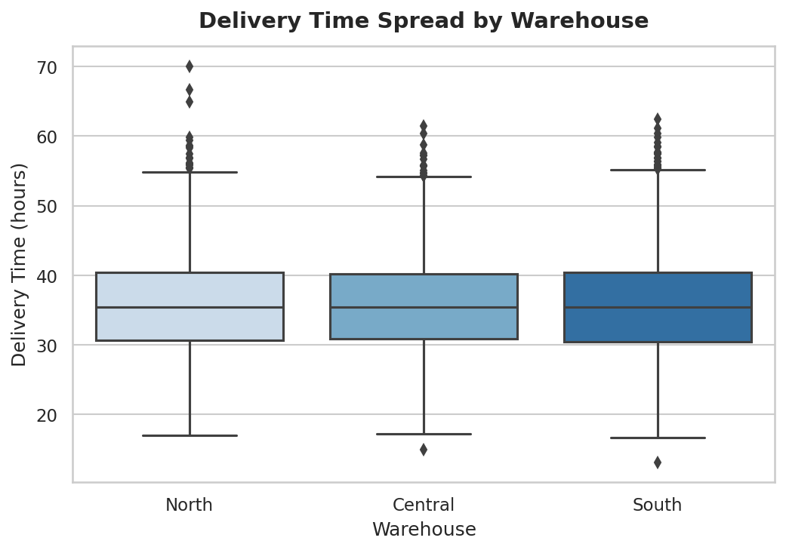
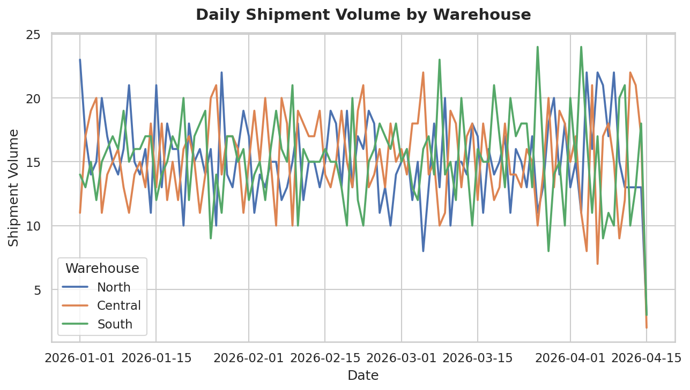
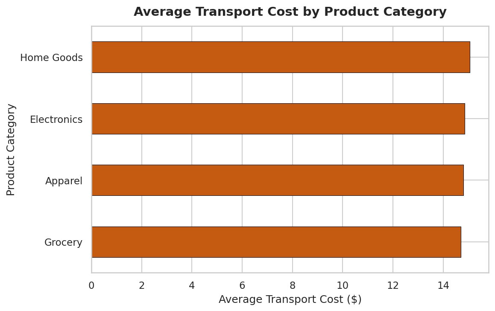
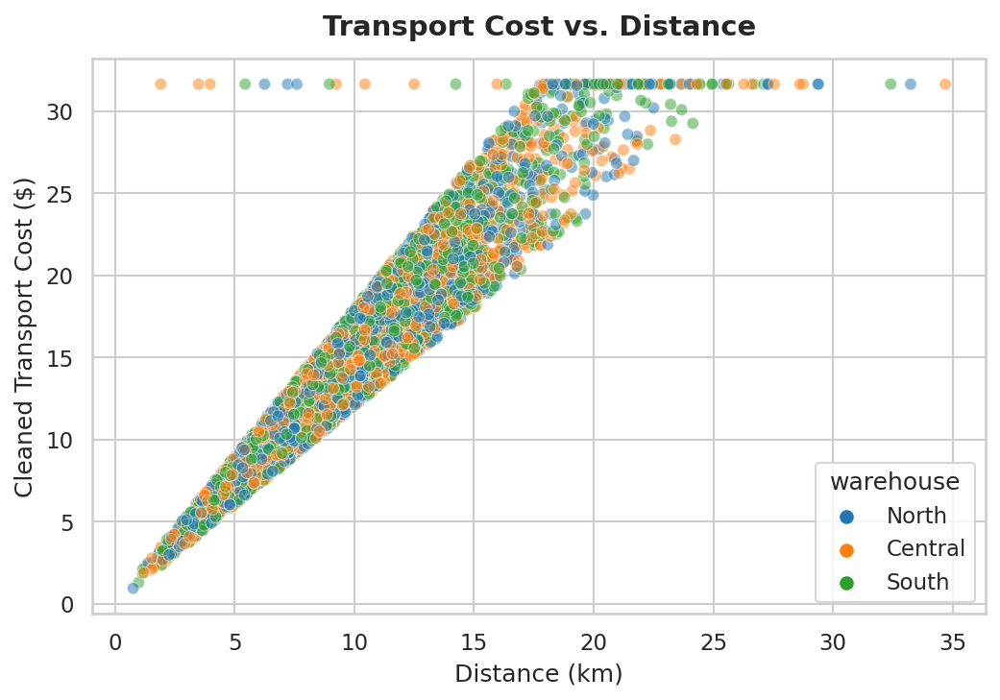

# Week 3 Advanced Data Analysis and Visualization in Logistics

---

## Dataset & Derived Variables

This analysis builds upon the cleaned Week 2 logistics dataset covering 90 days (Q1 2026) across DataCo's North, Central, and South regional warehouses. Two additional analytical variables were derived:

* **`delivery_time_hours`**: Calculated transit duration in hours (`(actual_delivery_date - order_date) / 3600`).
* **`shipment_volume`**: Daily aggregated order volume per warehouse.

---

## Exploratory Data Analysis & Visualizations

### 1. Delivery Time Distribution
Histogram with KDE overlay characterizing the right-skewed delivery times and delay risks across the logistics network.

---

### 2. Correlation Matrix
Heatmap quantifying linear relationships across variables, confirming transit distance as the primary driver of transport costs ($r = 0.94$).

---

### 3. Delivery Time Spread by Warehouse
Boxplot exposing transit time variability and outlier delays across the North, Central, and South hubs.

---

### 4. Daily Shipment Volume Trend
Multi-line time series tracking daily throughput, identifying weekend surges and promotional demand spikes at the Central facility.

---

### 5. Transport Cost Drivers by Product Category
Horizontal bar chart ranking categories by mean shipping expense, highlighting Home Goods and Electronics as the most expensive.

---

### 6. Transport Cost vs. Distance Relationship
Scatter plot demonstrating the positive linear relationship between transit distance and IQR-cleaned delivery costs.

---

## Key Strategic Insights

* **Operational Bottlenecks**: The South warehouse exhibits higher transit times and cost-to-distance ratios, requiring route optimization and fleet capacity reviews.
* **Cost Drivers**: Distance is the primary determinant of transport cost, with product categories (Home Goods and Electronics) acting as secondary drivers.
* **Capacity Planning**: Weekly weekend spikes and promotional surges at the Central warehouse indicate that dynamic fleet and labor allocation is required to prevent dispatch backlogs.
